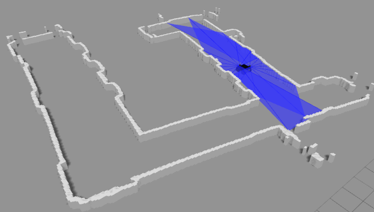
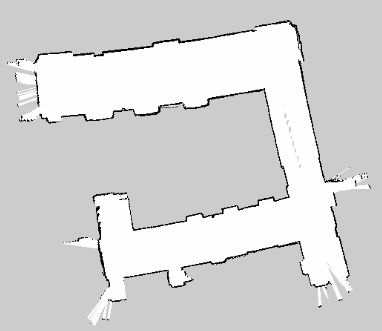

# map2world

An useful script written in python which automatically generate 3D gazebo world from 2D occupancy grid map.

## Requirments

* Python
* Gazebo 7.0 or higher 
* cv2
* lxml
* pyyaml

## Run

```
python map_to_world.py MAP_PATH_HERE
```

## Result

| Name | World | Occupancy Grid Map |
| ---- | ---- | ---- |
| generated_2020-02-13-14-36-38 |  |  |